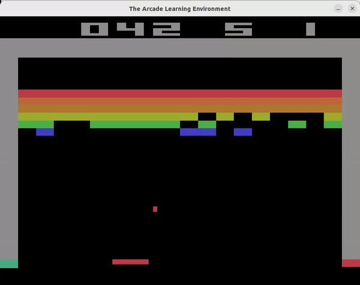
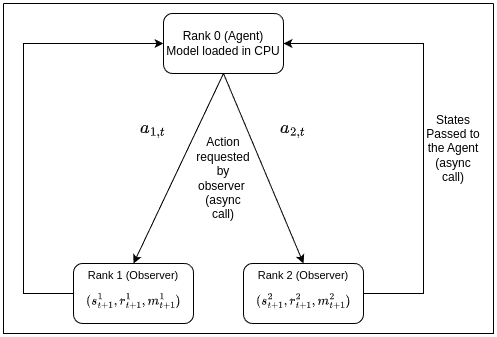
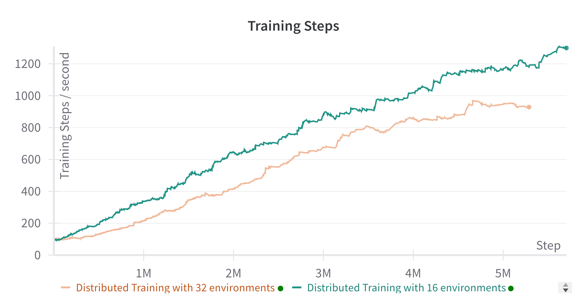
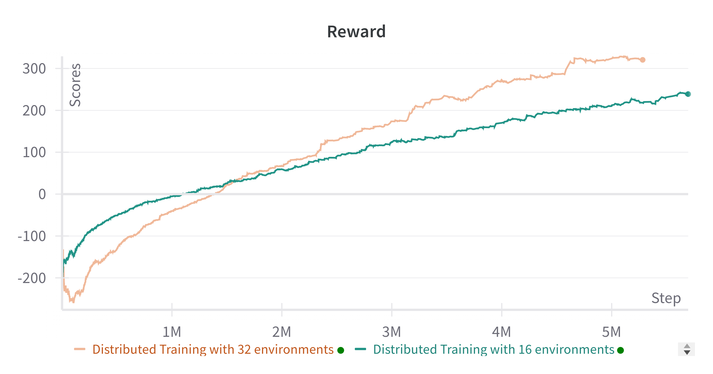

# Distributed Advantage Actor Critic 

The objective of this project is to demonstrate the capability of ["Efficient Parallel (PAAC) Methods for Deep Reinforcement Learning"](https://arxiv.org/abs/1705.04862) across compute nodes in a distributed setting in a synchronous fashion using the PyTorch's RPC framework. 

<br>



## Environment Details
- Ubuntu 20.04
- python 3.8.18
- PyTorch 2.1.0
- NumPy 1.24.3
- gym 0.26.2
- matplotlib 3.7.3

## Description
Our approach facilitates model training across multiple processes in a 
topology by providing mechanisms for remote communication. We extended the idea of PAAC to a distributed setting where we define two entities, Agent and
Observers. Each observer process or the *callee* will contain an instance of the environment to run and will pass the state vector $(s_{t+1}, r_{t+1}, m_{t+1})$ to the agent when requested. Agent process or the *caller* on the other hand will hold the model that needs to be trained and will use the remote
reference object from RPC to make calls to the remote machines. The framework for the distributed setting is shown below. 
<br>





## Usage
You can setup training using the proposed mechanism by:

```
python distributedPAAC/dpaac.py --env-name BreakoutDeterministic-v4 --num-workers 4
```

## Results

<p float="LunarLander Environment">
  
  
</p>


